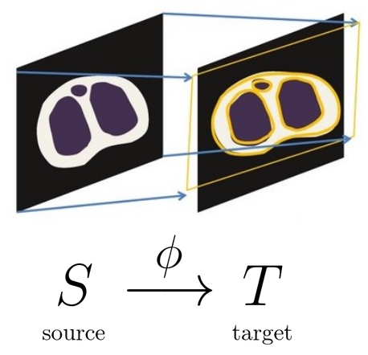
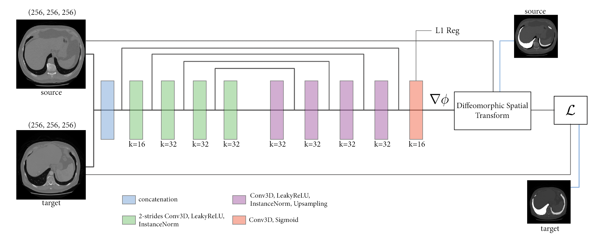

# Deep Learning for Deformable Fusion

## Project description

Image registration is one of the most critical problems in radiology targeting to establish correspondences between images modalities of the same patient or longitudinal studies. This problem is traditionally casted as an optimization problem. In the advent of deep learning, the objective of this project will be to study recent advances for unsupervised deep learning deformable registration in the context of CT images for radiation oncology.

<p align="center"></p>


__Based on the [LUNA16 dataset](https://luna16.grand-challenge.org/data/), we propose to use deep registration architectures to evaluates how leveraging segmentation data can help improve performances.__

<p align="center">
  
  <em> Prediction evolution through epochs, see report for more details </em>
</p>


## Repository description

```
├── bin
│   ├── experiment_1
│   ├── experiment_2
│   └── experiment_3
├── data
├── docs
│   ├── img
│   ├── reports
│   └── readings
├── notebooks
│   ├── sandbox
│   └── clean
│       └── stats_extract.py
├── src
│   ├── evaluation
│   ├── generators
│   ├── layers
│   ├── networks
│   │   └── networks_utils
│   └── training
└── utils
```

- `bin`: experiments directory
- `data`: contains MRI-image datasets and segmentation masks
- `docs`: useful papers, report and other
- `notebooks`: useful scripts and notebooks of ongoing work
- `src`: contains all modules useful to run an experiment
- `utils`: miscellaneous utilities

## Architecture scheme

<p align="center"></p>
